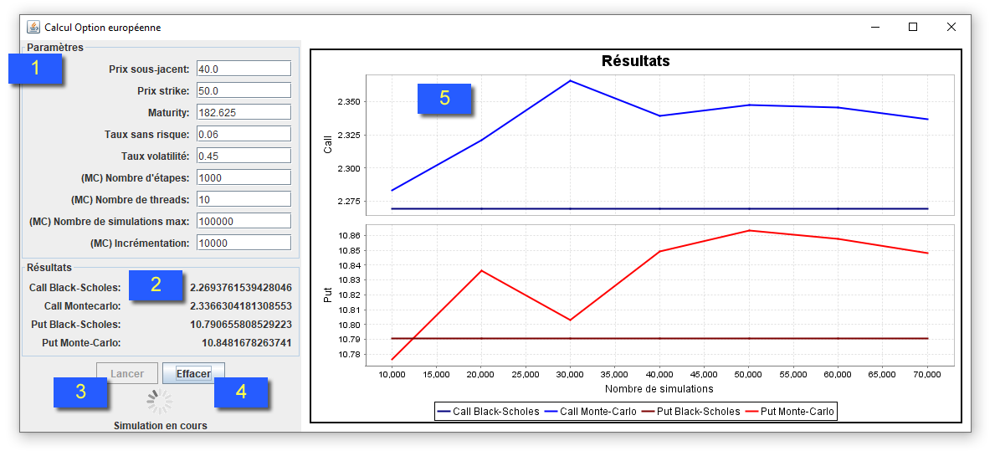
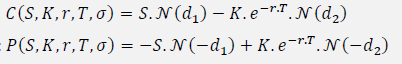
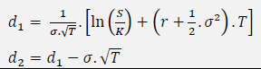

## Description and usage
This tool allows you to calculate the call and put of a European option using two methods:
- Black-Scholes (BS)
- Simulation de Monte-Carlo (MC)

It puts side by side the results obtained by the two methods so that they can be compared.  
To run the program, launch the `pricer.vue.Main` class, this is the only class having a main method.  

The UI is made up of 3 main parts. 

    

[1] Paramètres: Those are the parameters used to calculate the call and the put for the 2 methods. Every parameter that is preceded with (MC) is only used for the computation of the features for Monte-Carlo.  
[2] Résultats: Those are the results (call and put) of the last computation for the 2 methods.    
[3] Lancer: This button is used to launch the computation of the call and put for both methods by using the parameters in [1]  
[4] Effacer: Clears the plots in [5]  
[5] Résultats: This is the plotting area. Typically, the call value for both methods is drawn in the upper area and the put in the lower area. The features (call or put) are drawn vs the number of simulations. For Black-Scholes, the formula is an analytic one, so there is no simulation concept, hence the plot are straight lines. On the other hand, Monte-Carlo is about simulating several experiments and average the results. So these results get better and better as the number of simulation increases, that's why the corresponding plots change.
 
## Implementation
Let 

S = <Prix sous-jacent>  
T = <Maturity>/365  
K = <Prix strike>  
r = <Taux sans risque>  
σ = <Taux volatilité>  

### Black-Scholes
The formula to compute the put P and the call C of the European option according to Black-Scholes method is :  
 
   
where :  

 

N = Cumulative distribution function of the standard normal distribution N(0,1)

### Monte-Carlo simulation
Let :  
nSimulations = The number of simulations to run  
nSteps = <Nombre d'étapes>  
ε = A number drawn from the 

The Monte-Carlo algorithm is as follows:  

 

### Overview of the code
This is a multi-threaded application.  
The central class is `CalculWorker` which is a `SwingWorker`.
In its `doInBackground()` method, a `LanceCalculs`object is created (`LanceCalculs` is the class that launches the computation for both Black-Scholes and Monte-Carlo methods). 
Then the call and put of both BS and MC are computed by calling  `lanceCalculs()` method of `LanceCalculs` object.

The result of the computation is stored in a `ResultatCalcul` object which contains the call and put of BS and MC.
This object is then sent to the `CalculWorker` object through an event mechanism.
This mechanism works as follows. An Interface `ResultatCalculListener` acting as the receiver of the event is created. Every class that implements this interface should implement the `handleResultatCalcul(ResultatCalcul e)` which contains the code that should be executed when one receive a `ResultatCalcul`. When the computation of the feature is done, which is the event in our case, the sender of the ResultatCalcul should call fireResultatCalcul(), which in turn, execute the handleResultatCalcul() for each object registered as a listener of this event.
So in our case, `CalculWorker` is a `ResultatCalculListener` and has been registered as a listener of the `ResultatCalcul` event to the `LanceCalculs` object. So when the event is received, the `CalculWorker` draws the results in pane [4].
#### Computations
To do the computations, the abstract class `Calcul`is created. This class is a `Callable` which means its execution (running `call`method) can be done on a different Thread. 2 flavors of this class exist, `CalculBlackScholes` and `CalculMonteCarlo`. 
To actually perform the computation the method `Calcul.calculer()` is executed in the `call` method.

We want to see how the features evolve as the number of simulation increases. We will then perform the experiment

